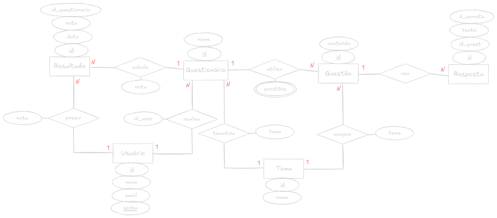

# Sistema de Avaliações

**RESUMO**: A proposta de trabalho é desenvolver um sistema que permita realizar avaliações e apresente relatórios e gráficos com consultas sobre esses dados.

#### DESCRIÇÃO GERAL
O sistema deve possibilitar cadastrar questões e avaliações, onde uma avaliação é formada por dados descritivos (e.g., descrição, data, horário, etc.) e uma seleção de questões cadastradas, sendo que uma questão pode ser usada em diferentes avaliações. As questões podem ser de diferentes tipos (e.g., múltipla escolha, texto livre, etc.). A cada avaliação deve ser possível associar os usuários que deverão fazê-la e registrar as suas respostas para cada questão. Devem ser disponibilizados relatórios relevantes considerando os dados armazenados, com dados agregados, tabelas e gráficos, como média, média comparativa com outros usuários, evolução temporal do desempenho nas avaliações, etc.  
A natureza do sistema de avaliação a ser desenvolvido é uma escolha do grupo, devendo ter suas particularidades implementadas. Por exemplo, em um sistema de avaliação de disciplinas as avaliações devem ter notas atribuídas, portanto, é preciso que as questões tenham um valor e uma forma de registrar a nota obtida por cada aluno em cada questão. Já em um sistema de avaliação de desempenho profissional, por exemplo, de avaliação docente, é preciso manter o sigilo das respostas. No exemplo de avaliação docente, é preciso garantir que um aluno avalie uma única vez cada disciplina em um ano/semestre, mas suas respostas não devem ser vinculadas ao seu usuário, mantendo o anonimato.  
As transações devem fazer as modificações necessárias no banco de dados utilizando, necessariamente, um ou mais controllers e os objetos das camadas de model e de acesso a dados. Os relatórios devem utilizar gráficos, tabelas e apresentar informações relevantes. Espera-se que as consultas utilizadas para produzir os relatórios explorem diferentes recursos da linguagem SQL (junções internas e externas, agregações, agrupamentos, ranking, ordenações, subconsultas, filtros diversos, etc.). Os relatórios também fazendo uso de objetos da camada de acesso a dados, possivelmente, objetos específicos para a geração dos relatórios.

#### ESPECIFICAÇÕES
O back-end do sistema deve ser feito em **Java/J2EE** e o front-end em **JavaScript** (sugestão: React) ou **JSP/XHTML**. Podem ser usados frameworks e bibliotecas para facilitar o desenvolvimento, com exceção de implementações da JPA (Java Persistence API), como o Hibernate e similares.  
O SGBD utilizado deve ser o **PostgreSQL**.

---

# Escopo e Detalhamento
#### IDEIA
A ideia principal do projeto é criar um banco de questões com o tema de segurança de dados.  
A aplicação deve operar realizando uma seleção de níveis e tipos de questões, aglomerando-as para criar um conjunto de questões relacionadas, em que, a partir de um método de avaliação em tempo real, o usuário receba feedbacks sobre seus conhecimentos acerca do tema.  

#### RELATÓRIOS DE DESEMPENHO
O objetivo é avaliar o conhecimento do usuário sobre o tema por meio de perguntas diversas. Ao completar um questionário, será mostrado um *score* de desempenho naquela série de perguntas. Também haverá uma tela com um gráfico mostrando o desempenho geral do usuário no tempo. Além disso, serão exibidos dados sobre o tipo de questão com mais erros e acertos do usuário e, baseado nisso, dicas de estudo em determinado tópico.  
Em resumo, o sistema de relatórios terá:
- Relatório de desempenho com **score por questionário**;
- Tela com **gráfico** mostrando o **desempenho pelo tempo**;
- Dados contendo tópicos de **maiores acertos** e **maiores erros**;
- **Dicas de estudo** para tópicos com **maiores erros**.

#### DER
